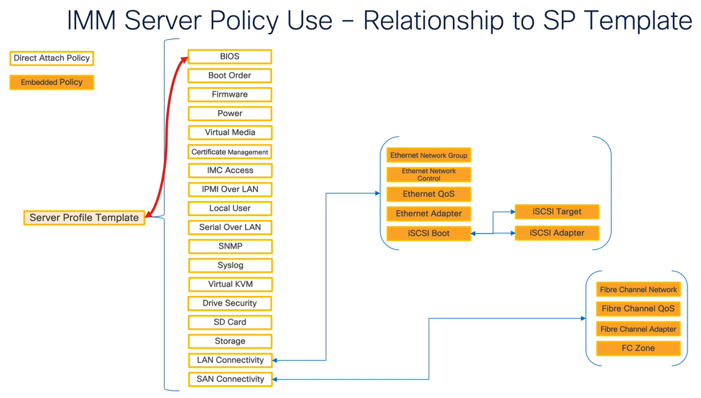

# Performance Tuning Best Practices for BIOS Policy

The purpose of the scripts in this directory is to show how to deploy BIOS policies with the Intersight Powershell module while aligning to the Performance Tuning Guides.

## Resources

* [IMM BIOS Tokens](https://www.cisco.com/c/en/us/td/docs/unified_computing/ucs/Intersight/IMM_BIOS_Tokens_Guide/b_IMM_Server_BIOS_Tokens_Guide/b_UCS_BIOS_Tokens_Guide_chapter_01.html)
* [Performance Tuning Best Practices Guide for UCS M7](https://www.cisco.com/c/en/us/products/collateral/servers-unified-computing/ucs-b-series-blade-servers/ucs-m7-platforms-wp.html)
* [Performance Tuning Best Practices Guide for UCS M6](https://www.cisco.com/c/en/us/products/collateral/servers-unified-computing/ucs-b-series-blade-servers/performance-tuning-guide-ucs-m6-servers.html)

## Requirements
* PowerShell 7.1 or later is [required](https://github.com/CiscoDevNet/intersight-powershell#11-requirements)
* Download PowerShell 7 for Windows [here](https://docs.microsoft.com/en-us/powershell/scripting/install/installing-powershell-on-windows)
* Download PowerShell 7 for MacOS [here](https://learn.microsoft.com/en-us/powershell/scripting/install/installing-powershell-on-macos?view=powershell-7.3#installation-via-direct-download)
* Alternatively, here is a one-liner to download and install PowerShell 7 on Windows
```powershell
iex "& { $(irm https://aka.ms/install-powershell.ps1) } -UseMSI"
```

## Install Intersight PowerShell Module
```PowerShell
Install-Module -Name Intersight.PowerShell
```

## Update Intersight PowerShell Module *(Optional)*
```PowerShell
Update-Module -Name Intersight.Powershell
```

## Import Intersight PowerShell Module
```PowerShell
Import-Module -Name Intersight.PowerShell
```

## Generate API credentials and import as environment variables:

* Create an API key and secret key file within Intersight.  You can [generate those credentials here.](https://intersight.com/an/settings/api-keys/)
* Import the Variables into your Environment:
```PowerShell
$env:ApiKeyId = "xxxxx27564612d30dxxxxx/5f21c9d97564612d30dd575a/5f9a8b877564612xxxxxxxx" #Changeme
$env:ApiKeyFilePath = "C:\SecretKey.txt" #Changeme
```

## Authentication to Intersight
https://github.com/CiscoDevNet/intersight-powershell#authenticate-the-user
```PowerShell
$onprem = @{
    BasePath = "https://intersight.com"
    ApiKeyId = $env:ApiKeyId
    ApiKeyFilePath = $env:ApiKeyFilePath
    HttpSigningHeader =  @("(request-target)", "Host", "Date", "Digest")
}

Set-IntersightConfiguration @onprem
```
## Usage
```Powershell
.\M7-BIOS-Virtualization.ps1
```

## Helpful command to find BIOS Tokens:
```Powersehll
(Get-Command New-IntersightBiosPolicy).Parameters.Values | Select-Object Name, Aliases, SwitchParameter | Where-Object {$_.Name -Like '*workload*'}
```

## Translation Table
| Setting                       | BIOS Token Name                   |
|-------------------------------|-----------------------------------|
| AdjacentCacheLinePrefetch     | Adjacent cache line prefetcher    |
| CpuPerformance                | CPU performance                   |
| IpPrefetch                    | DCU IP prefetcher                 |
| StreamerPrefetch              | DCU streamer prefetch             |
| EnergyEfficientTurbo          | Energy-efficient turbo mode       |
| EngPerfTuning                 | Energy performance tuning         |
| CpuPerfEnhancement            | Enhanced CPU performance          |
| HardwarePrefetch              | Hardware prefetcher               |
| ImcInterleave                 | IMC interleaving                  |
| IntelHyperThreadingTech       | Intel Hyper-Threading Technology  |
| IntelTurboBoostTech           | Intel Turbo Boost Technology      |
| IntelVirtualizationTechnology | Intel Virtualization Technology   |
| IntelVtForDirectedIo          | Intel VT for Directed I/O         |
| LlcAlloc                      | LLC dead line                     |
| LlcPrefetch                   | LLC prefetch                      |
| MemoryRefreshRate             | Memory refresh rate               |
| PackageCstateLimit            | Package C-state limit             |
| PatrolScrub                   | Patrol scrub                      |
| ProcessorC1e                  | Processor C1E                     |
| ProcessorC6report             | Processor C6                      |
| SelectMemoryRasConfiguration  | Memory RAS configuration          |
| Snc                           | Sub-NUMA clustering               |
| UfsDisable                    | Uncore frequency scaling          |
| UpiLinkEnablement             | UPI link enablement               |
| UpiPowerManagement            | UPI power management              |
| VirtualNuma                   | Virtual NUMA                      |
| WorkLoadConfig                | WorkLoadConfig                    |
| XptRemotePrefetch             | XPT remote prefetch               |
| XptPrefetch                   | XPT prefetch                      |

## BIOS Policy Mapping
